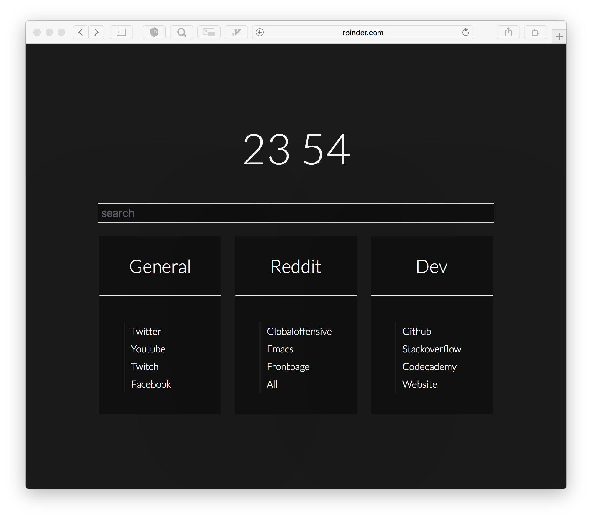

# Startpage

Test it out at [rpinder.com/startpage](http://rpinder.com/startpage)

## Commands
+ 't' takes you to a specified twitter account
+ 'tw' takes you to a specified twitch account
+ 'r' takes you to a specified subreddit
+ 'y' searches youtube
+ 'a' searches amazon

## How to use commands
To use a command (such as 'r') you simply type out the command, leave a space, and then type in your input to the command. An example for the 'r' command would be 

r startpages 

to take you to [r/startpages](https://reddit.com/r/startpages)
